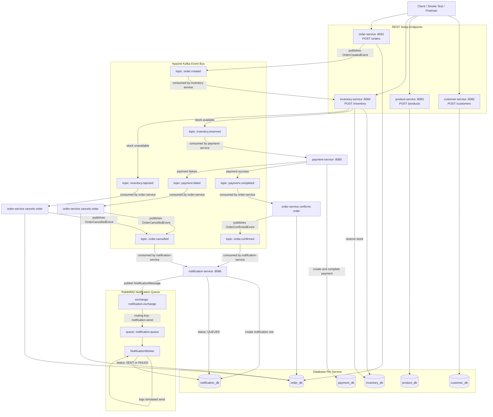

# E-commerce Queues and Events

Event-driven e-commerce microservices project built with Java, Spring Boot, Kafka, RabbitMQ, PostgreSQL, Docker Compose, and GitHub Actions.

## Overview

This project demonstrates a backend e-commerce flow using independent Spring Boot microservices. Each service owns its own PostgreSQL database, communicates through REST for basic CRUD operations, and uses Kafka/RabbitMQ for asynchronous business events.

## Tech Stack

* Java 17
* Spring Boot 3.5.x
* Spring Web
* Spring Data JPA
* PostgreSQL
* Flyway
* Apache Kafka
* RabbitMQ
* Docker Compose
* GitHub Actions
* Maven multi-module build

## Services

| Service              | Port | Responsibility                                          |
| -------------------- | ---: | ------------------------------------------------------- |
| order-service        | 8081 | Creates orders and publishes order events               |
| customer-service     | 8082 | Manages customer data                                   |
| product-service      | 8083 | Manages product data                                    |
| inventory-service    | 8084 | Reserves/rejects stock from order events                |
| payment-service      | 8085 | Processes payments after inventory reservation          |
| notification-service | 8086 | Creates and sends notifications from final order events |

## Event Flow

```text
Order Created
    ↓ Kafka: order.created
Inventory Reserved / Rejected
    ↓ Kafka: inventory.reserved / inventory.rejected
Payment Completed / Failed
    ↓ Kafka: payment.completed / payment.failed
Order Confirmed / Cancelled
    ↓ Kafka: order.confirmed / order.cancelled
Notification Created
    ↓ RabbitMQ: notification.queue
Notification Sent
```

## Infrastructure

Local Docker Compose provides:

* PostgreSQL database per service
* Kafka broker
* RabbitMQ with management UI

RabbitMQ UI:

```text
http://localhost:15672
username: guest
password: guest
```

## Run Locally

Start infrastructure:

```bash
docker compose up -d
```

Run all Maven tests:

```bash
mvn clean test
```

Package all services:

```bash
mvn package -DskipTests
```

Run one service:

```bash
mvn -pl order-service spring-boot:run
```

Use the same pattern for other services:

```bash
mvn -pl customer-service spring-boot:run
mvn -pl product-service spring-boot:run
mvn -pl inventory-service spring-boot:run
mvn -pl payment-service spring-boot:run
mvn -pl notification-service spring-boot:run
```

## Main Endpoints

| Service              | Endpoint Examples                                                                                       |
| -------------------- | ------------------------------------------------------------------------------------------------------- |
| customer-service     | `POST /customers`, `GET /customers`, `GET /customers/{id}`                                              |
| product-service      | `POST /products`, `GET /products`, `GET /products/{id}`                                                 |
| inventory-service    | `POST /inventory`, `GET /inventory/product/{productId}`, `PATCH /inventory/product/{productId}/reserve` |
| order-service        | `POST /orders`, `GET /orders`, `GET /orders/{id}`                                                       |
| payment-service      | `GET /payments/order/{orderId}`, `PATCH /payments/order/{orderId}/complete`                             |
| notification-service | `GET /api/notifications/order/{orderId}`, `PATCH /api/notifications/{id}/sent`                          |

## CI/CD

GitHub Actions workflow:

```text
.github/workflows/local-ci-compose.yaml
```

Pipeline steps:

1. Checkout code
2. Set up Java 17
3. Run Maven tests
4. Package all services
5. Generate CI Docker Compose file
6. Build and start the full system
7. Run JavaScript smoke tests
8. Print logs on failure
9. Shut down containers

Custom local action:

```text
.github/actions/generate-ci-compose
```

Smoke test folder:

```text
scripts/smoke-test
```

## Project Structure

```text
.
├── customer-service
├── product-service
├── order-service
├── inventory-service
├── payment-service
├── notification-service
├── scripts/smoke-test
├── .github/actions/generate-ci-compose
├── .github/workflows/local-ci-compose.yaml
├── compose.yaml
├── Dockerfile
└── pom.xml
```

## Current Status

* Base REST APIs implemented
* PostgreSQL and Flyway configured per service
* Kafka event flow implemented between order, inventory, payment, and notification services
* RabbitMQ notification queue implemented in notification-service
* Docker Compose infrastructure available locally
* GitHub Actions CI pipeline added for build, compose startup, and smoke testing


## Architecture Diagram


