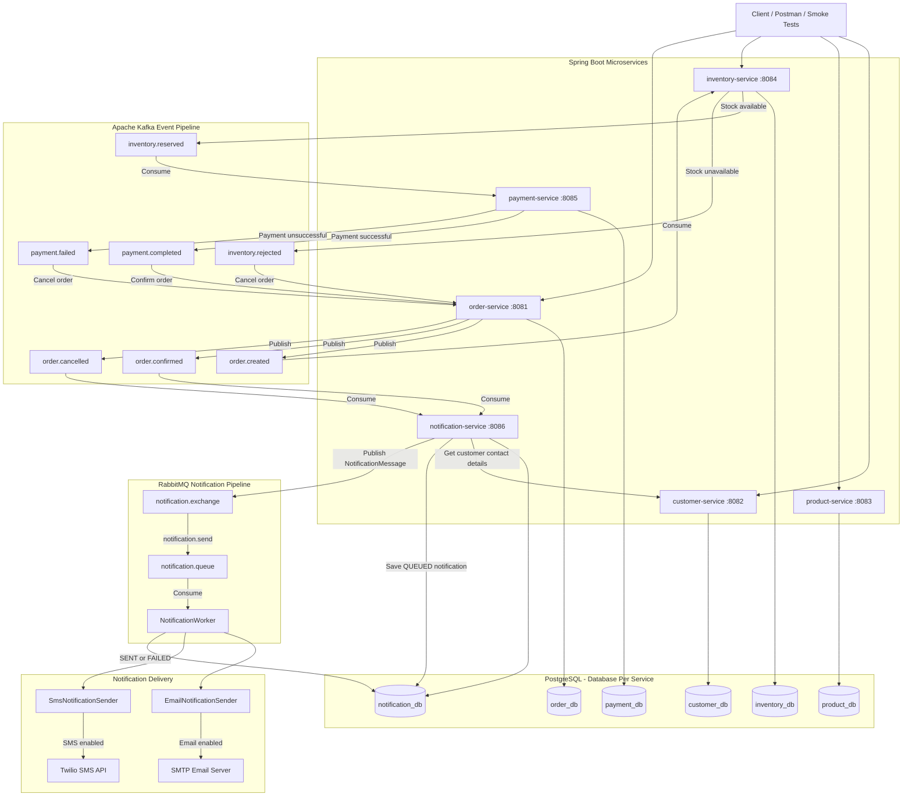

# E-commerce Queues and Events

Event-driven e-commerce microservices project built with Java, Spring Boot, Kafka, RabbitMQ, PostgreSQL, Docker Compose, and GitHub Actions.

## Overview

The system uses REST APIs for basic data management and asynchronous messaging for the order-processing workflow. Each microservice owns its own PostgreSQL database.

## Tech Stack

* Java 17 and Spring Boot 3.5.15
* Spring Web, Spring Data JPA, Flyway, and Actuator
* Apache Kafka and RabbitMQ
* PostgreSQL
* SMTP email with Spring Mail
* Twilio SMS
* Docker Compose and GitHub Actions
* Maven multi-module build

## Services

| Service              | Port | Responsibility                                |
| -------------------- | ---: | --------------------------------------------- |
| order-service        | 8081 | Creates orders and manages final order status |
| customer-service     | 8082 | Manages customer contact information          |
| product-service      | 8083 | Manages products                              |
| inventory-service    | 8084 | Reserves or rejects inventory                 |
| payment-service      | 8085 | Processes payments                            |
| notification-service | 8086 | Sends email and SMS notifications             |

## Kafka Pipeline

```text
POST /orders
    -> order.created
    -> inventory-service
       -> inventory.reserved -> payment-service
          -> payment.completed -> order confirmed
          -> payment.failed    -> order cancelled
       -> inventory.rejected   -> order cancelled
    -> order.confirmed or order.cancelled
    -> notification-service
```

Kafka topics:

```text
order.created
inventory.reserved
inventory.rejected
payment.completed
payment.failed
order.confirmed
order.cancelled
```

## Notification Pipeline

```text
order.confirmed / order.cancelled (Kafka)
    -> notification-service gets customer email and phone
    -> notification saved with QUEUED status
    -> notification.exchange
    -> routing key: notification.send
    -> notification.queue
    -> RabbitMQ worker
    -> SMTP email + Twilio SMS
    -> status updated to SENT or FAILED
```

Email and SMS delivery can be enabled independently. SMS is disabled by default.

## Run Locally

Start PostgreSQL, Kafka, and RabbitMQ:

```bash
docker compose up -d
```

Run all tests:

```bash
mvn clean test
```

Run a service:

```bash
mvn -pl order-service spring-boot:run
```

Replace `order-service` with any other service module as needed.

RabbitMQ management UI:

```text
http://localhost:15672
username: guest
password: guest
```

## Email and SMS Configuration

Configure `notification-service` with environment variables. Do not commit real credentials.

```env
NOTIFICATION_EMAIL_ENABLED=true
NOTIFICATION_EMAIL_FROM=no-reply@example.com
MAIL_HOST=localhost
MAIL_PORT=1025
MAIL_USERNAME=
MAIL_PASSWORD=
MAIL_SMTP_AUTH=false
MAIL_SMTP_STARTTLS_ENABLE=false

NOTIFICATION_SMS_ENABLED=false
TWILIO_ACCOUNT_SID=
TWILIO_AUTH_TOKEN=
TWILIO_FROM_PHONE_NUMBER=
```

## Main Endpoints

| Service              | Endpoint examples                                                                                            |
| -------------------- | ------------------------------------------------------------------------------------------------------------ |
| customer-service     | `POST /customers`, `GET /customers`, `GET /customers/{id}`                                                   |
| product-service      | `POST /products`, `GET /products`, `GET /products/{id}`                                                      |
| inventory-service    | `POST /inventory`, `GET /inventory/product/{productId}`, `PATCH /inventory/product/{productId}/reserve`      |
| order-service        | `POST /orders`, `GET /orders`, `GET /orders/{id}`                                                            |
| payment-service      | `GET /payments/order/{orderId}`, `PATCH /payments/order/{orderId}/complete`                                  |
| notification-service | `GET /api/notifications`, `GET /api/notifications/order/{orderId}`, `GET /api/notifications/status/{status}` |

## CI/CD

The GitHub Actions workflow at `.github/workflows/local-ci-compose.yaml`:

1. Runs Maven tests and packages all services.
2. Generates the CI Docker Compose file.
3. Builds and starts the complete system.
4. Runs JavaScript health and event-flow smoke tests.
5. Prints logs on failure and removes containers.

## Architecture Diagram


